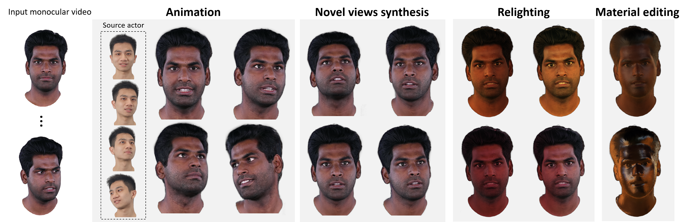
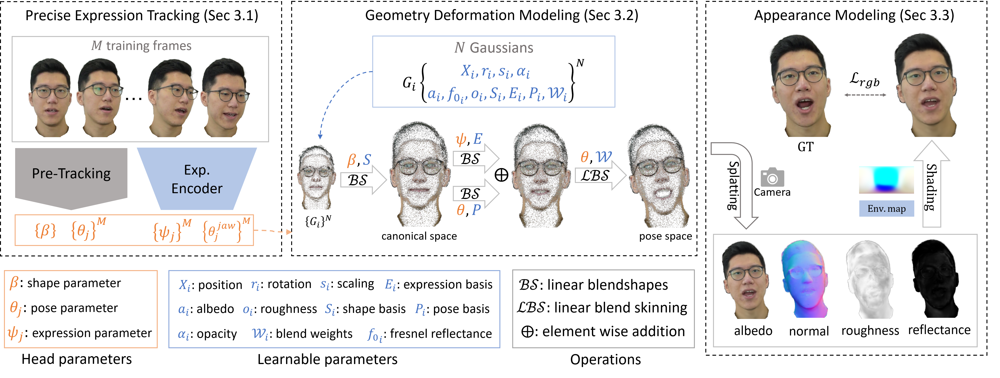

<p align="center">
  <h1 align="center">[CVPR 2025] HRAvatar: High-Quality and Relightable Gaussian Head Avatar</h1>
<p align="center">
  
<!-- [Dongbin Zhang](https://github.com/EastbeanZhang), [Yunfei Liu](https://liuyunfei.net/),[Lijian Lin](https://scholar.google.com/citations?hl=en&user=Xf5_TfcAAAAJ), [Ye Zhu](https://scholar.google.com/citations?hl=en&user=qhp9rIMAAAAJ),[Kangjie Chen](https://github.com/chenkangjie1123), [Minghan Qin](https://github.com/minghanqin), [Yu Li†](https://yu-li.github.io/),[Haoqian Wang†](https://www.sigs.tsinghua.edu.cn/whq_en/main.htm)
  <br>(† means corresponding author)<br>| [Webpage](https://eastbeanzhang.github.io/HRAvatar/) | [Full Paper](https://arxiv.org/abs/2503.08224) | [Video](https://www.youtube.com/watch?v=ZRwTHoXKtgc) |<be> -->

<p align="center">
  <a href="https://github.com/EastbeanZhang">Dongbin Zhang</a><sup>1,2</sup>, 
  <a href="https://liuyunfei.net/">Yunfei Liu</a><sup>2</sup>,
  <a href="https://scholar.google.com/citations?hl=en&user=Xf5_TfcAAAAJ">Lijian Lin</a><sup>2</sup>, 
  <a href="https://scholar.google.com/citations?hl=en&user=qhp9rIMAAAAJ">Ye Zhu</a><sup>2</sup>, 
  <a href="https://github.com/chenkangjie1123">Kangjie Chen</a><sup>1</sup>, 
  <a href="https://github.com/minghanqin">Minghan Qin</a><sup>1</sup>, 
  <a href="https://yu-li.github.io/">Yu Li</a><sup>2†</sup>,
  <a href="https://www.sigs.tsinghua.edu.cn/whq_en/main.htm">Haoqian Wang</a><sup>1†</sup>
  <br>( <sup>1</sup>Tsinghua University, <sup>2</sup>International Digital Economy Academy )<br>
</p>

<p align="center">
  🌐 <a href="https://eastbeanzhang.github.io/HRAvatar/">Webpage</a> | 
  📄<a href="https://arxiv.org/pdf/2503.08224">Full Paper</a> | 
  🎥 <a href="https://www.youtube.com/watch?v=ZRwTHoXKtgc">Video</a>
</p>

## 📌 Introduction
This repository contains the official author's implementation associated with the paper "HRAvatar: High-Quality and Relightable Gaussian Head Avatar".

HRAvatar, a 3DGS-based method that reconstructs high-fidelity, relightable 3D head avatars, achieves real-time rendering and realistic visual effects under varying lighting conditions.

<p align="center">
  
</p>

|  |
| :----------------------------------------------------------: |
| Pipeline of HRAvatar |   

## 🖥️ Cloning the Repository
```shell
# SSH
git clone git@github.com:EastbeanZhang/HRAvatar.git --recursive
```
or
```shell
# HTTPS
git clone https://github.com/EastbeanZhang/HRAvatar.git --recursive
```

The components have been tested on Ubuntu Linux 18.04. Instructions for setting up and running each of them are in the below sections.

## 📂 Datasets preparation
Download the insta dataset (already with extracted mask) from [INSTA](https://github.com/Zielon/INSTA). The dataset can be accessed [here](https://keeper.mpdl.mpg.de/d/5ea4d2c300e9444a8b0b/).

The HDTF videos we used can be downloaded from [here](https://drive.google.com/drive/folders/1lJMrNuvCSCDwMsd6Pz7W3cH_jXPt_fKv?usp=sharing).


## 🛠️ Setup

#### Optimizer
The optimizer uses PyTorch and CUDA extensions in a Python environment to produce trained models. 

#### Hardware Requirements

- CUDA-ready GPU with Compute Capability 7.0+
- 24 GB VRAM (to train to paper evaluation quality)

#### Software Requirements
- Conda (recommended for easy setup)
- C++ Compiler for PyTorch extensions (we used VS Code)
- CUDA SDK 11 for PyTorch extensions (we used 11.7)
- C++ Compiler and CUDA SDK must be compatible

### Environment Setup
Our default, provided install method is based on Conda package and environment management:
```shell
conda env create --file environment.yml
conda activate HRAvatar
cd submodules
git clone https://github.com/NVlabs/nvdiffrast.git
pip install nvdiffrast
pip install diff-gaussian-rasterization_c10
pip install simple-knn
```

## 🔧 Data Preprocessing

Data preprocessing for each video includes several steps: frame extraction, foreground extraction, keypoint estimation, and face tracking.

For the INSTA dataset, we directly use the provided masks.
```shell
# example script
bash preprocess/preprocess_shell/insta/bala_preprocess.sh
```

For the HDTF dataset or custom videos, you can run the following script:
```shell
# example script
bash preprocess/preprocess_shell/HDTF/marcia_preprocess.sh
```

Use Intrinsic Anything to extract albedo as pseudo-GT.
```shell
# example script
bash preprocess/preprocess_shell/extract_albedo.sh
```

For more details on data preprocessing, refer to [Data_Preprocessing](assets/docs/Data_Preprocessing.md)

Environment map filtering is described in [Filter_Envmap](assets/docs/Filter_Envmap.md)


## 🎯 Traning

For INSTA DATASET

```shell
# example script
CUDA_VISIBLE_DEVICES=0  python train.py --source_path /path/to/bala \
  --model_path outputs/insta/bala  --eval  --test_set_num 350  --epochs 15 
```


For HDTF
```shell
# example script
CUDA_VISIBLE_DEVICES=0  python train.py --source_path /path/to/marcia \
  --model_path outputs/HDTF/marcia  --eval  --test_set_num 500  --epochs 15 \
  --max_reflectance 0.8 --min_reflectance 0.04 --with_envmap_consist
```

For Custom DATASET
```shell
# example script
# Note: Lower learning rates can lead to better geometry 
#       but may degrade quantitative metrics (e.g., PSNR, SSIM)
CUDA_VISIBLE_DEVICES=0  python train.py --source_path /path/to/subject \
  --model_path outputs/custom/subject  --eval  --test_set_num 500  --epochs 15 \
  --max_reflectance 0.8 --min_reflectance 0.04 --with_envmap_consist \
  --expression_dirs_lr 1e-7 --pose_dirs_lr 1e-7 --shape_dirs_lr 1e-8 \
  --position_lr_init 5e-5 --position_lr_final 5e-7
```


## 🎨 Rendering

Render the training and testing results  
(This is automatically done after training by default)
```shell
# example script
CUDA_VISIBLE_DEVICES=0 python render.py  --model_path outputs/insta/bala
```

Render others
Add arguments in render.py
```shell
--skip_test # Skip rendering self-reenactment test set results
--skip_train # Skip rendering self-reenactment training set results
--render_albedo # Render albedo component
--render_normal # Render normal component
--render_irradiance # Render irradiance component
--render_specular # Render specular component
--render_roughness  # Render roughness component
--render_reflectance # Render reflectance component
--render_depth  # Render depth map
--render_envmap # Visualize optimized environment map
--render_relighting # Perform relighting render
--with_relight_background # Use input environment map as background during relighting
--envmap_path assets/envmaps/cobblestone_street  # Filtered environment map for relighting
--render_material_editing # Render material editing results (gradually increase reflectance)
--corss_source_path  # Render cross-reenactment results (specify the processed data path of another subject)
--test_static_material_edting_idxs 100 # Apply material editing to a specific image
--test_static_relight_idxs 100  # Apply relighting to a specific image
```

### Evaluation
(This is automatically done after training by default)
```shell
# example script
python metrics.py --model_path outputs/insta/bala
```

## 📖 BibTeX
If you find our work helpful, please cite:
```bibtex
@InProceedings{HRAvatar,
    author    = {Zhang, Dongbin and Liu, Yunfei and Lin, Lijian and Zhu, Ye and Chen, Kangjie and Qin, Minghan and Li, Yu and Wang, Haoqian},
    title     = {HRAvatar: High-Quality and Relightable Gaussian Head Avatar},
    booktitle = {Proceedings of the Computer Vision and Pattern Recognition Conference (CVPR)},
    month     = {June},
    year      = {2025},
    pages     = {26285-26296}
}
```

## 🙏 Acknowledgement
We sincerely appreciate the contributions of the research community that made this work possible.  

Our implementation is built upon the PyTorch framework for **3D Gaussian Splatting** from [GraphDeco-Inria](https://github.com/graphdeco-inria/gaussian-splatting). We thank the authors for their open-source efforts and inspiring research.  

We also acknowledge the developers and maintainers of the following projects, which played a crucial role in our implementation:  

- **[nvdiffrast](https://github.com/NVlabs/nvdiffrast)**: NVIDIA's differentiable rasterizer, used for efficient shading.  
- **[diff-gaussian-rasterization](https://github.com/graphdeco-inria/diff-gaussian-rasterization)**: The differentiable Gaussian rasterization library, essential for rendering.
- **[FLAME](https://flame.is.tue.mpg.de/)**: A 3D head model that provided a strong foundation for our work. 
- **[SMIRK](https://github.com/georgeretsi/smirk)**: For providing a valuable framework for FLAME parameter estimation.  
- **[INSTA](https://github.com/Zielon/INSTA)** and **[HDTF](https://github.com/MRzzm/HDTF)** datasets, which we used for training and evaluation.  

Finally, we thank our collaborators, colleagues, and the open-source community for their valuable discussions and continuous support.
