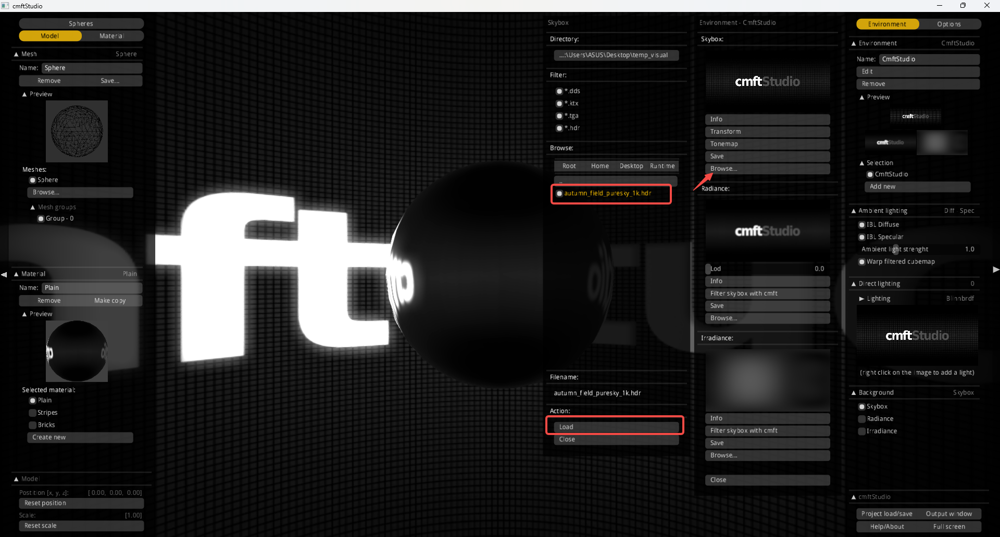
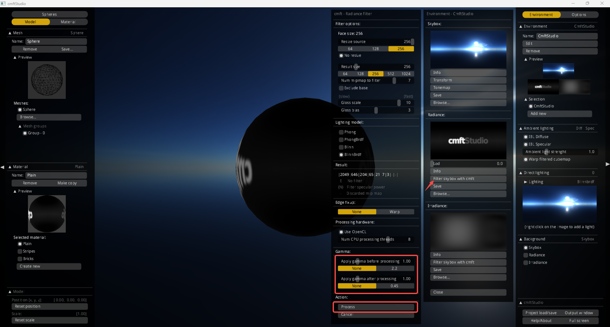
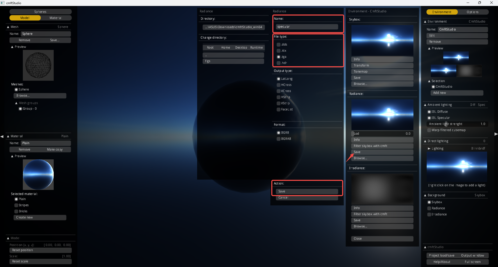
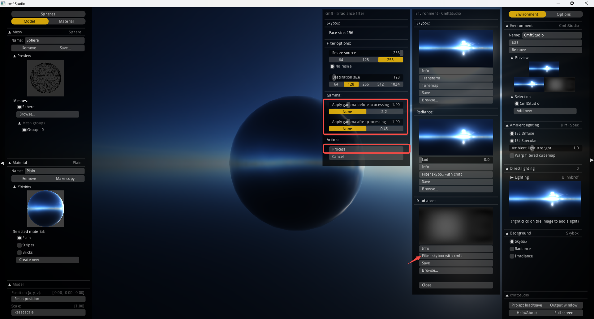
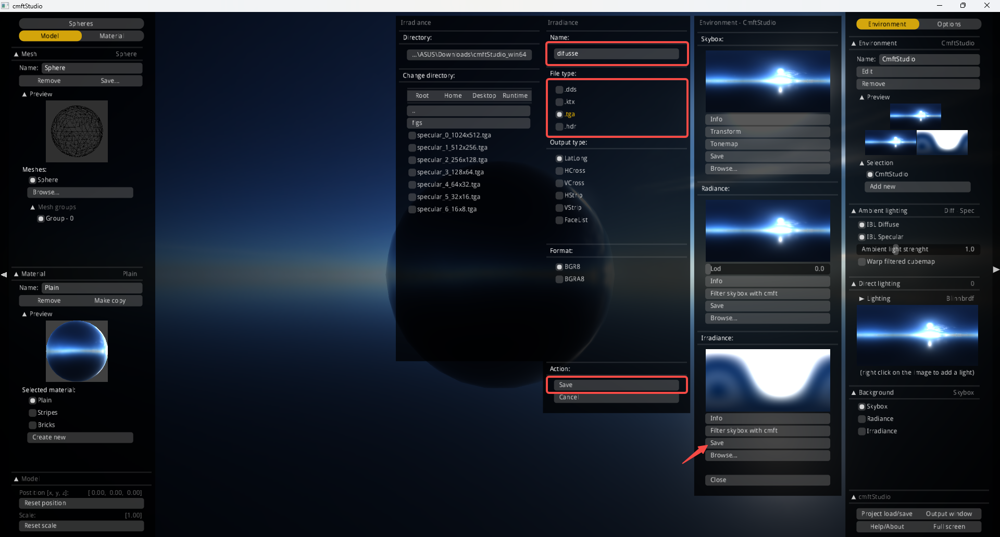

<h1 align="center">Filtering Environment Maps</h1>

## 📌 Introduction
[`CMFT`](https://github.com/dariomanesku/cmft) is an open-source tool for **cubemap filtering**, used to generate **radiance** and **irradiance** maps from an environment map. 

This document provides step-by-step instructions on using `CMFT` for filtering.

To get started, you can download some **HDR environment maps** from [Poly Haven](https://polyhaven.com/hdris).  
- Choose an **HDR format** (`.hdr`).
- Select a **1K resolution** for quick processing.

## 🚀 For Linux (Command Line)

### 🛠️ Installation
To install `cmft` on Linux, follow these steps:
```shell
cd submodules
git clone git://github.com/dariomanesku/cmft.git
cd cmft
make
# Build for your Linux system
make linux-release64
cd ../..
```

### 🎛️ Filtering Environment Maps

Filtering the Radiance Map
```shell 
CMFT=submodules/cmft/_build/linux64_gcc/bin/cmftRelease
envmap_path=assets/envmaps/autumn_field_puresky
eval $CMFT $@ --input "$envmap_path/autumn_field_puresky_1k.hdr"  \
       ::Filter options                  \
       --filter radiance                 \
       --srcFaceSize 256                 \
       --excludeBase false               \
       --mipCount 7                      \
       --generateMipChain false          \
       --glossScale 10                   \
       --glossBias 3                     \
       --lightingModel blinnbrdf         \
       --edgeFixup none                  \
       --dstFaceSize 256                 \
       ::Processing devices              \
       --numCpuProcessingThreads 8       \
       --useOpenCL true                  \
       --clVendor anyGpuVendor           \
       --deviceType gpu                  \
       --deviceIndex 0                   \
       ::Aditional operations            \
       --inputGammaNumerator 1.0         \
       --inputGammaDenominator 1.0       \
       --outputGammaNumerator 1.0        \
       --outputGammaDenominator 1.0      \
       ::Output                          \
       --outputNum 1                     \
       --output0 "$envmap_path/specular" \
       --output0params tga,bgr8,latlong 
```

Filtering the Irradiance Map
```shell 
eval $CMFT $@ --input "$envmap_path/autumn_field_puresky_1k.hdr"  \
       ::Filter options                  \
       --filter irradiance               \
       --srcFaceSize 256                 \
       --dstFaceSize 128                 \
       ::Aditional operations            \
       --inputGammaNumerator 1.0         \
       --inputGammaDenominator 1.0       \
       --outputGammaNumerator 1.0        \
       --outputGammaDenominator 1.0      \
       ::Output                          \
       --outputNum 1                     \
       --output0 "$envmap_path/diffuse"  \
       --output0params tga,bgr8,latlong  \
```

## 🚀 For Windows (Option-GUI)


For Windows systems, you can use [`cmftStudio`](https://github.com/dariomanesku/cmftStudio), which provides a **GUI-based** approach for filtering environment maps more conveniently.

### 🛠️ Installation

1. Download the **cmftStudio Windows 64-bit** version: [Download cmftStudio](https://github.com/dariomanesku/cmftStudio-bin/raw/master/cmftStudio_win64.zip).
2. Extract the downloaded ZIP file.


### 🎛️ Usage
<details>
    <summary>Click to expand 🎛️ Usage instructions</summary>

1. **Open `cmftStudio.exe`**  
   Launch the application to begin the filtering process.

2. **Load the environment map**  
   Navigate to the environment map file and load it into the tool.  
   

3. **Filter the Radiance Map**  
   Adjust the settings to generate the radiance maps.  
   

4. **Save the filtered Radiance Map**  
   Export the filtered radiance map to the desired format.  
   


5. **Filter the Irradiance Map**  
   Configure the parameters and process the irradiance map.  
   

6. **Save the Irradiance Map**  
   Export the processed irradiance map.  
   

</details>


## 🙏 Acknowledgement
Special thanks to [`cmft`](https://github.com/dariomanesku/cmft) and [`cmftStudio`](https://github.com/dariomanesku/cmftStudio) for providing open-source tools for cubemap filtering.